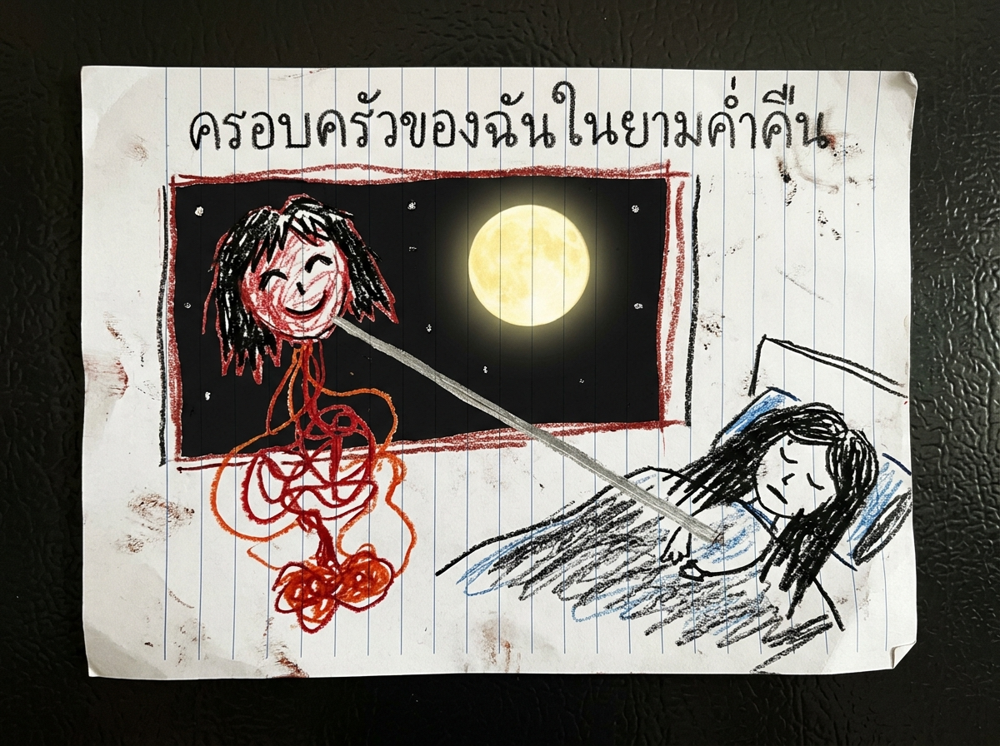

**ใบงานวิชาศิลปะ โรงเรียนบ้านหนองเสือ**  
**หัวข้อ:** "บ้านของฉันและครอบครัวในยามค่ำคืน"

---

#### **ภาพวาดประกอบใบงาน (แนบหลักฐานหมายเลข #ART-2025-10):**

  
  
ภาพถ่ายสแกนใบงานสีเทียนต้นฉบับของ น้องตะวัน (ป.2) ยึดโดยพนักงานสอบสวน

---

#### **คำบรรยายภาพวาดด้วยสีเทียนของ น้องตะวัน (ป.2):**

> *"ตอนกลางคืนหนูมองออกไปนอกหน้าต่างห้องนอน เห็นหัวของคุณยายลอยอยู่กลางอากาศ มีผมยาวสีดำและสายลำไส้สีแดงห้อยอยู่ข้างล่าง... และมี **สายสะดือสีเงินเส้นใหญ่** เชื่อมต่อจากหัวที่ลอยอยู่ กลับเข้ามาหาตัวคุณแม่ที่กำลังนอนหลับอยู่บนเตียง..."*

---

**บันทึกของคุณครูประจำชั้น (เขียนด้วยปากกาแดง):**  
*(ห้ามให้ผู้ปกครองฝั่งพ่อเห็นใบงานฉบับนี้เด็ดขาด ให้ส่งต่อพนักงานพัฒนาสังคม)*
